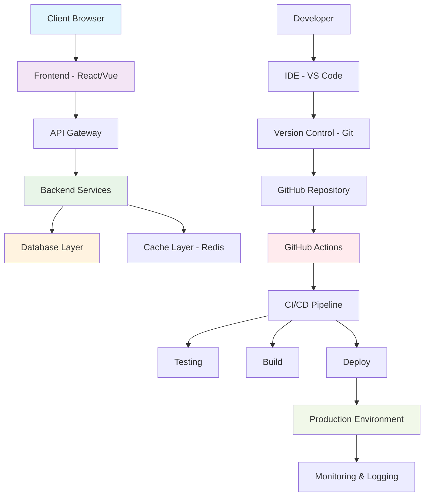

# DemoTestFul - Full Stack Development Project

A demonstration full stack project showcasing development tools, workflows, and architecture.

## 🛠️ Top 5 IDEs for Full Stack Development

| IDE | Language Support | Platform | Price | Key Features | Rating |
|-----|------------------|----------|-------|--------------|--------|
| **Visual Studio Code** | JavaScript, TypeScript, Python, Java, C#, Go, etc. | Windows, macOS, Linux | Free | Extensions, IntelliSense, Git integration, Debugging | ⭐⭐⭐⭐⭐ |
| **JetBrains WebStorm** | JavaScript, TypeScript, HTML, CSS, Node.js | Windows, macOS, Linux | $129/year | Advanced refactoring, Smart code completion, Built-in tools | ⭐⭐⭐⭐⭐ |
| **Sublime Text** | Multiple languages via packages | Windows, macOS, Linux | $99 (one-time) | Fast performance, Multiple cursors, Command palette | ⭐⭐⭐⭐ |
| **Atom** | JavaScript, HTML, CSS, Python, etc. | Windows, macOS, Linux | Free | GitHub integration, Package ecosystem, Customizable | ⭐⭐⭐ |
| **IntelliJ IDEA** | Java, Kotlin, Scala, JavaScript, Python | Windows, macOS, Linux | $499/year | Enterprise features, Smart coding assistance, Framework support | ⭐⭐⭐⭐⭐ |

## 🏗️ Project Architecture

This project demonstrates a modern full stack architecture with automated workflows and comprehensive tooling.



## 🚀 Features

- **Modern Architecture**: Microservices-based backend with React frontend
- **Automated CI/CD**: GitHub Actions for continuous integration and deployment
- **Code Quality**: ESLint, Prettier, and automated testing
- **Documentation**: Comprehensive README and inline documentation
- **Monitoring**: Built-in logging and performance monitoring

## 📋 Getting Started

### Prerequisites

- Node.js (v16 or higher)
- Docker (for containerization)
- Git

### Installation

```bash
# Clone the repository
git clone https://github.com/ajeetraina/demotestful.git
cd demotestful

# Install dependencies
npm install

# Start development server
npm run dev
```

### Development Workflow

1. **Setup IDE**: Use any of the recommended IDEs from the table above
2. **Code**: Write your features following the project structure
3. **Test**: Run automated tests with `npm test`
4. **Commit**: Push changes to trigger GitHub Actions
5. **Deploy**: Automatic deployment on successful builds

## 🔄 CI/CD Pipeline

Our GitHub Actions workflow includes:

- **Code Quality Checks**: Linting and formatting
- **Automated Testing**: Unit and integration tests
- **Security Scanning**: Dependency vulnerability checks
- **Build Process**: Optimized production builds
- **Deployment**: Automated deployment to staging/production

## 📊 Project Structure

```
demotestful/
├── src/
│   ├── frontend/          # React/Vue frontend code
│   ├── backend/           # Node.js/Express backend
│   └── shared/            # Shared utilities and types
├── tests/                 # Test suites
├── docs/                  # Documentation
├── .github/workflows/     # GitHub Actions
└── docker/               # Docker configurations
```

## 🤝 Contributing

1. Fork the repository
2. Create a feature branch
3. Make your changes
4. Add tests for new features
5. Submit a pull request

## 📄 License

This project is licensed under the MIT License - see the [LICENSE](LICENSE) file for details.

## 🔗 Links

- [Live Demo](https://demotestful.herokuapp.com)
- [Documentation](https://docs.demotestful.com)
- [Issues](https://github.com/ajeetraina/demotestful/issues)

---

**Built with ❤️ by the DemoTestFul team**