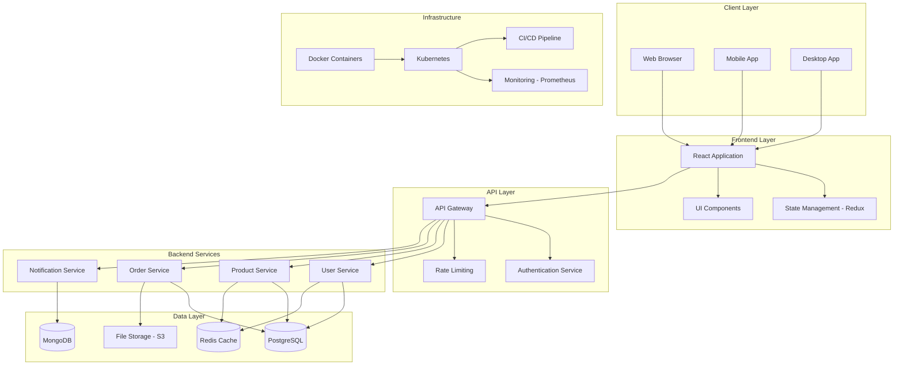
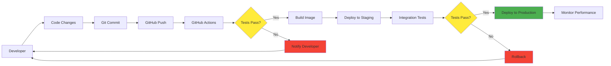
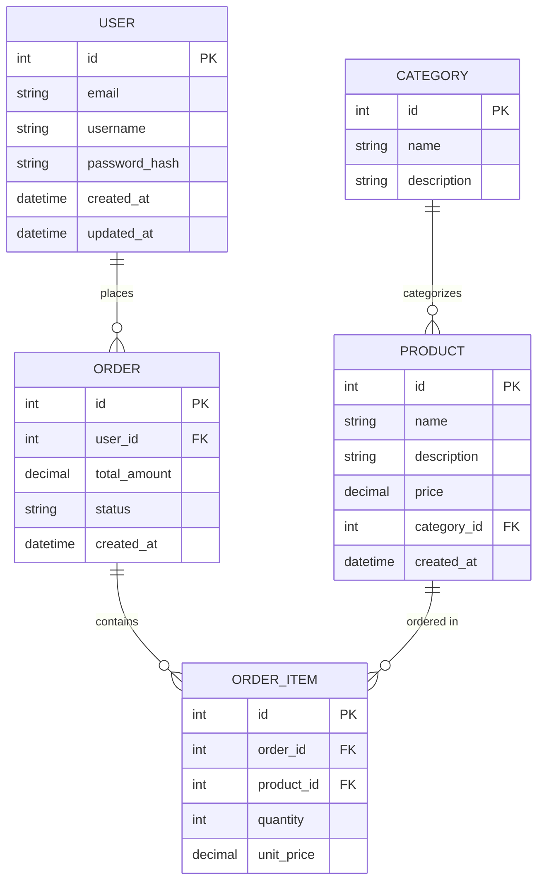
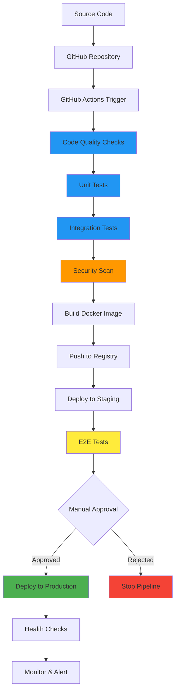
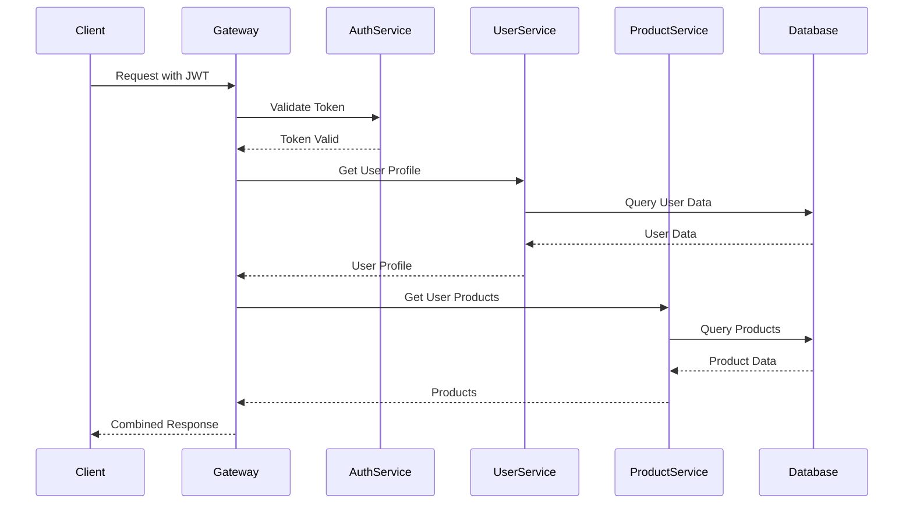
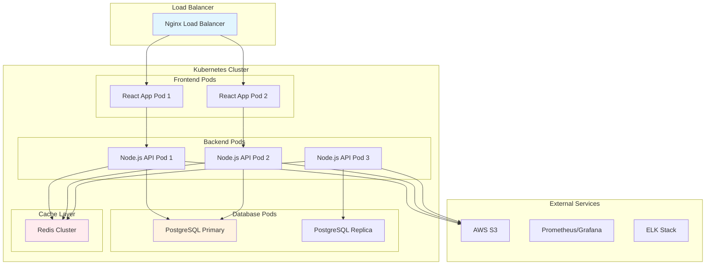
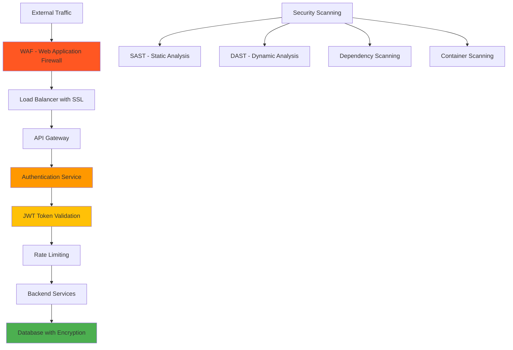
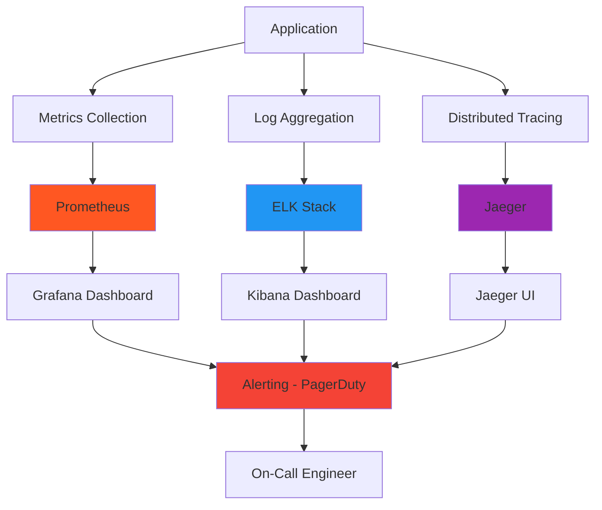

# Project Architecture - DemoTestFul

This document provides a detailed overview of the project architecture using Mermaid diagrams.

## System Architecture Overview

## Development Workflow

## Database Schema Relationships

## CI/CD Pipeline Flow

## Microservices Communication

## Infrastructure Architecture

## Security Architecture

## Monitoring and Observability

